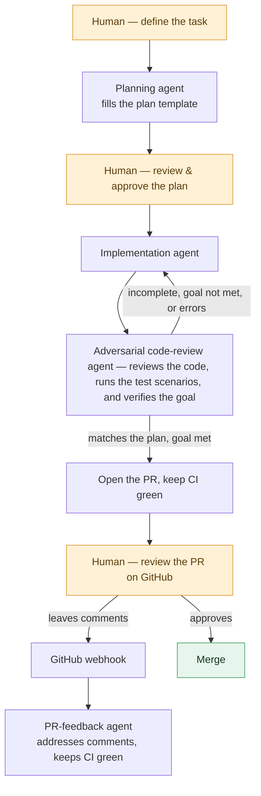

# Bottega

Bottega is a multi-agent orchestration tool for engineering teams who want an "AI sandwich" approach: Human at the start & the end, AI in the middle.

Bottega ships as a specification plus a working reference implementation.

It runs as a web UI, is team-first (multi-user), and remote-first (you can run it locally, but it's designed to run on a server).

The tool aims to replicate a typical dev workflow: plan, implement, run the QA scenarios that define the goal, loop until that goal is met (the *Ralph Wiggum loop*), respond to PR comments on GitHub, etc.

It supports Claude Code, Codex, and OpenCode so you can mix and match models on the same task. For example, use Opus for planning, Sonnet for implementation, Codex for code review, and an open-source model to manage the PR (monitor the CI, fix conflicts), etc.

See the demo:

https://github.com/user-attachments/assets/ca10c517-d511-46b2-80a2-b417a5966875

Want to see how we use it in practice? We share our experience after shipping our 1000th user story with this tool on a production codebase (a large Rails monolith) [launch post](https://vdaubry.github.io/bottega-launch/)

## How it works

Bottega replicates a normal dev workflow as a loop of specialised agents, with a
human at both ends.



## A spec-first project

**The specification is the product.** This project ships specs so you can build
your own version of the tool.

A complete, working implementation is provided in [`reference/`](reference). 

Every team will probably want a different flavor: point
your preferred coding agent at this repository, explain your requirements, and
build your own version.

- **[`SPEC.md`](SPEC.md)** is the entry point: a short master index.
- **[`core/`](core)** specifies the universal orchestration engine — the
  `planning → (implementation ⇄ review loop) → pull request`.
- **[`extra/`](extra)** specifies opinionated, optional features (the Kanban
  board, different harness integrations, multi-user auth, …). Pick the ones you want;
  skip the rest.
- **[`reference/`](reference)** is one complete, working implementation. It's the implementation we use daily internally, with our own set of preferences. It's a *citation* for the spec, not the
  canonical version.

Read the spec for **what to build and why**; read `reference/` for **one
way it was solved**. Where the two ever disagree, the spec wins.

### Why spec-first

Most of the value we get out of this tool is easy to implement. The core is a tight orchestration
loop and nothing more. 
Different teams will want different things: support for Gemini, adding a compliance agent in the loop, tasks sourced from Jira or Notion instead of a
kanban board.
**Fork it and build your own.**

Contributions are most welcome in the form of additional specs — see "How to Contribute".

## Build your own

1. Clone or fork this repo.
2. Point a coding agent at [`SPEC.md`](SPEC.md): *"Read SPEC.md and build this."*
3. Implement all of [`core/`](core) for a minimal working tool; add whichever
   [`extra/`](extra) features fit your team.
4. Swap the opinionated parts for your own — replace the board with a Jira sync,
   add a harness the reference doesn't ship, change the agent prompts.

You don't have to use the reference's stack (TypeScript / React / Express /
SQLite). The spec describes behavior; build it however you like.

## Running the reference implementation

The reference app lives in [`reference/`](reference), and all commands below run
from there.

### Stack

- React 18 + Vite + Tailwind (frontend)
- Node.js + Express + WebSocket (backend)
- SQLite (better-sqlite3) for metadata and message storage

### Prerequisites

- **Node.js** 18+ (tested on Node 20 and 22)
- **pnpm** 11 — install with `npm install -g pnpm@11`
- **At least one agent runtime** — install whichever provider(s) you plan to
  use:
  - **Claude Code**
  - **Codex**
  - **OpenCode**

> **Notes**
> - Each provider's SDK is a thin wrapper around its CLI, which Bottega spawns
>   as a subprocess — so the runtime must be installed on the host.
> - You don't need to pre-authenticate Claude Code or Codex; Bottega's built-in
>   OAuth flow handles login on first use.

### Getting started

```bash
git clone https://github.com/vdaubry/bottega.git
cd bottega/reference        # the reference implementation lives here
npm install -g pnpm@11      # skip if pnpm 11 is already installed
pnpm install
cp .env.example .env
```

Open `.env` and set `JWT_SECRET` to a random secret:

```bash
openssl rand -hex 64        # paste the output as JWT_SECRET in .env
```

Then run the interactive setup and start the server:

```bash
pnpm onboarding     # creates your admin account and seeds a sample project
pnpm dev
```

- Frontend: http://localhost:5173
- Backend:  http://localhost:3001

### Connecting a provider

Before your first chat or agent run, Bottega shows a blocking **Connect a
provider** modal — you must connect at least one of Claude Code, Codex, or
OpenCode. Credentials are stored per user, so each teammate connects their own Claude/Codex/OpenCode account. Each provider
authenticates differently:

- **Claude Code / Codex** — click **Authenticate**, open the generated URL in
  your browser, authorize, then paste the returned code back into the app. No
  API key needed; it uses your subscription via OAuth.
- **OpenCode** — paste a Zen API key (from
  [opencode.ai/zen](https://opencode.ai/zen)) into the panel.

### Onboarding wizard

`pnpm onboarding` runs in two steps and is idempotent — re-running it is safe and
skips completed steps:

1. **Create an admin account.** Prompts for username and password, stored as a
   bcrypt hash. The first user is automatically granted admin.
2. **Seed a sample project.** Copies
   [`examples/landing-page/`](reference/examples/landing-page) to
   `~/bottega-examples/landing-page/`, initializes a git repo there, and adds it
   to your dashboard with one pending task. This gives you something concrete to
   point your agent at on your first conversation.

If you'd rather start from your own repo, skip `pnpm onboarding`, run `pnpm dev`,
register an admin via the web UI, and add a project pointing at any git repo on
your machine.

## How to Contribute

Bottega is built to be forked. **The most valuable thing you can do is build your
own version**, and we'd love to hear about what you make — come say hello in
[Discussions](https://github.com/vdaubry/bottega/discussions).

Contributions back to *this* repository are welcome, with one guideline that
keeps the project small:

- **Spec changes — encouraged.** New or improved spec files are the
  contributions we most want: clarifications, new `extra/` features, better
  explanations, or fixes to the `core/` docs. Open a PR that touches `SPEC.md`,
  `core/`, or `extra/`.
- **Reference implementation — bug fixes only.** The reference is the tool we chose to use; you're welcome to use it if you share our preferences. It's not intended to accumulate features and become a bloated, one-size-fits-all tool. 
  We'll review changes that correct a defect or bring the reference back in line with the spec. 
  New features can be proposed as a new `extra/` spec here rather than as reference code.

In short: **grow the spec, fix the reference, fork for everything else.**

## Get in touch

Questions, ideas, feedback, or want to share what you built? **[GitHub
Discussions](https://github.com/vdaubry/bottega/discussions)** is the place — you
don't need a bug or a technical problem to start a thread, just say hi.

Please keep **[Issues](https://github.com/vdaubry/bottega/issues)** for bug
reports and spec PRs (see [How to Contribute](#how-to-contribute)); everything
else belongs in Discussions.

## Yet another orchestration tool

As we were working on this, a bunch of orchestration tools emerged. Variants of the same workflow we were converging on.

- [Conductor](https://www.conductor.build/), by Melty Labs (YC S24).
- [GasTown](https://github.com/steveyegge/gastown), by Steve Yegge.
- [gstack](https://github.com/garrytan/gstack), by Garry Tan.
- [SpecKit](https://github.com/github/spec-kit), by GitHub.
- [Symphony](https://github.com/openai/symphony), by OpenAI.

There is a lot of overlap with what we built. For us, this is a huge confirmation that we were on the right path.

Where Bottega differs:

**Remote-first and multi-player.** While you can run it on your laptop, Bottega is remote-first by design — we run it on a shared dev box. 
It supports multiple concurrent users out of the box. 
Side benefit 1: sandboxing autonomous agents on a remote server was easier for us than sandboxing them on each laptop.
Side benefit 2: a lot of non-technical people use it internally.
Side benefit 3: because it's always-on, reacting to GitHub is trivial: a PR review posted on GitHub fires a webhook at the box and kicks off a fresh agent run to address the comments. No laptop needs to be awake.

**Multi-harness.** Bottega drives Claude Code, Codex, and OpenCode behind one interface, so you can assign a different model to each role on the same task.

**Minimalist UX.** The core ideas are super simple: we are just recreating the typical web developer workflow. And we wanted the tool to reflect that simplicity. 
Side benefit: easy to onboard the whole product team.

---

## License

MIT — see [LICENSE](LICENSE).
